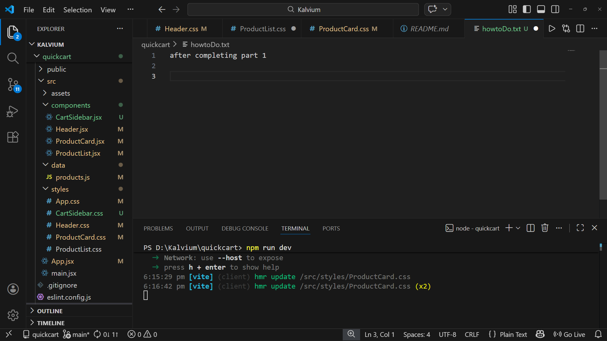
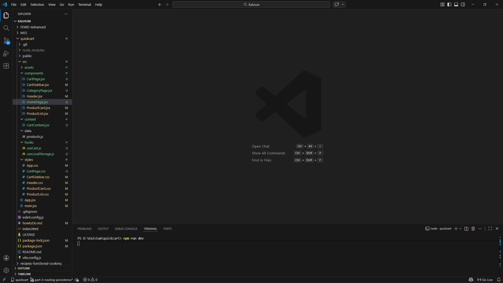

after completing part 1

after completing part 2

STEP 1 - Structure your Project

STEP 2 — Install React Router

Run in terminal:

npm install react-router-dom

STEP 3 — Update main.jsx

Change from Part 2 Wrap app with CartProvider

STEP 4 — Create Global Cart Context

STEP 5 — Create localStorage Hook

STEP 6 — Update App.jsx (Routing)

Major Change from Part 2

removed cart state added router

STEP 7 — Create HomePage.jsx

STEP 8 — Create CategoryPage.jsx

STEP 9 — Create CartPage.jsx

STEP 10 — Update Header for Navigation

WHAT CHANGED FROM PART 2
  Part 2	           Part 3
useState cart   	Context API
Props drilling	    Global state
Single page	        Multi page
No persistence  	localStorage
No search	        Search bar
Sidebar only	    Full cart page

at last before submitting it should look like 

